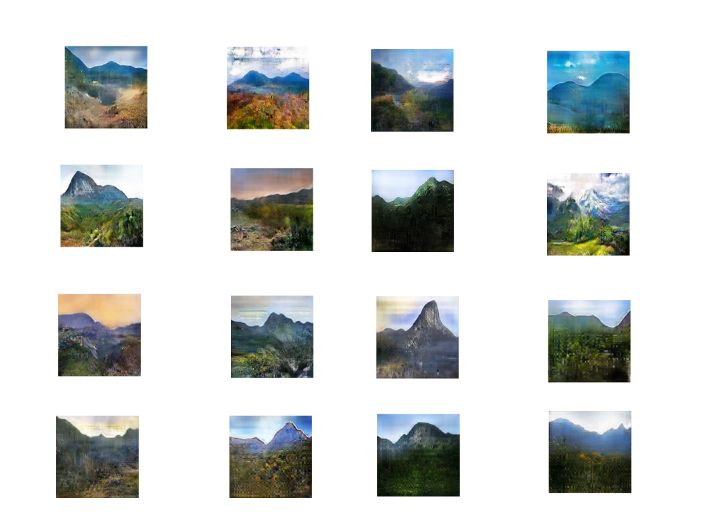
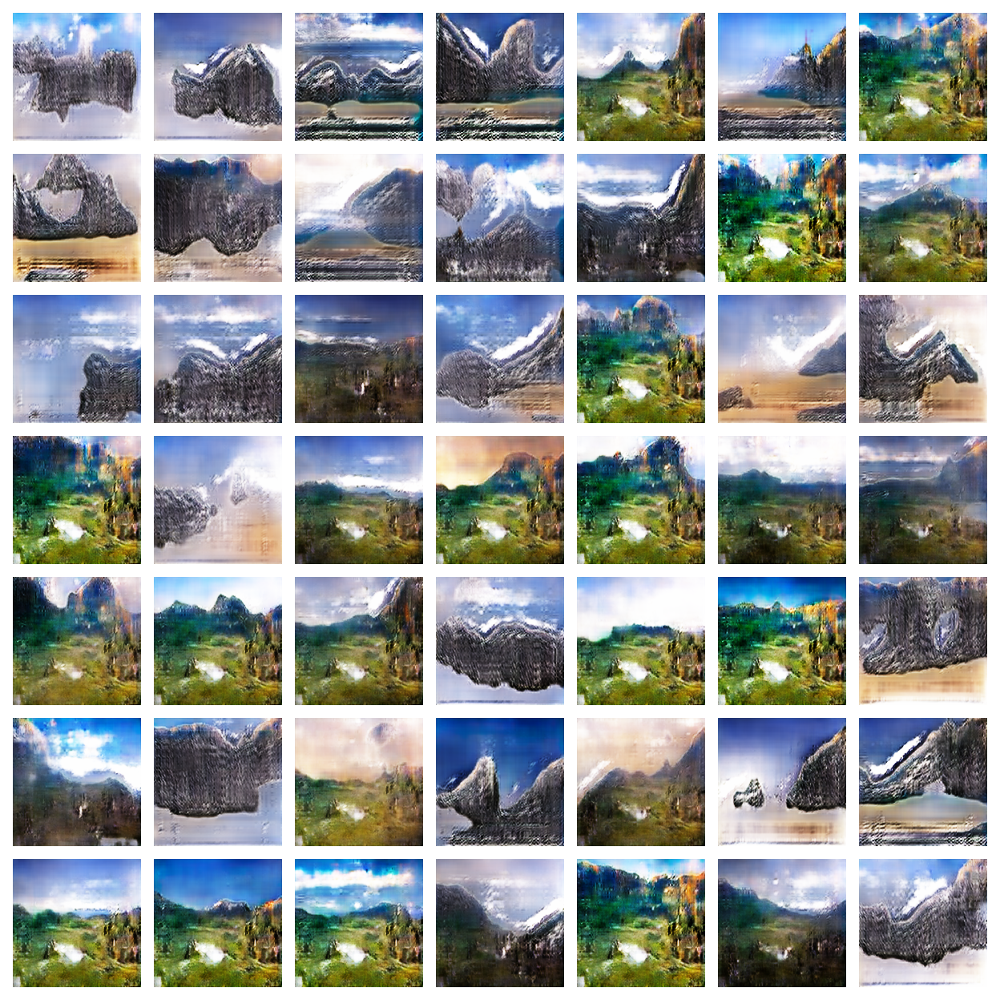
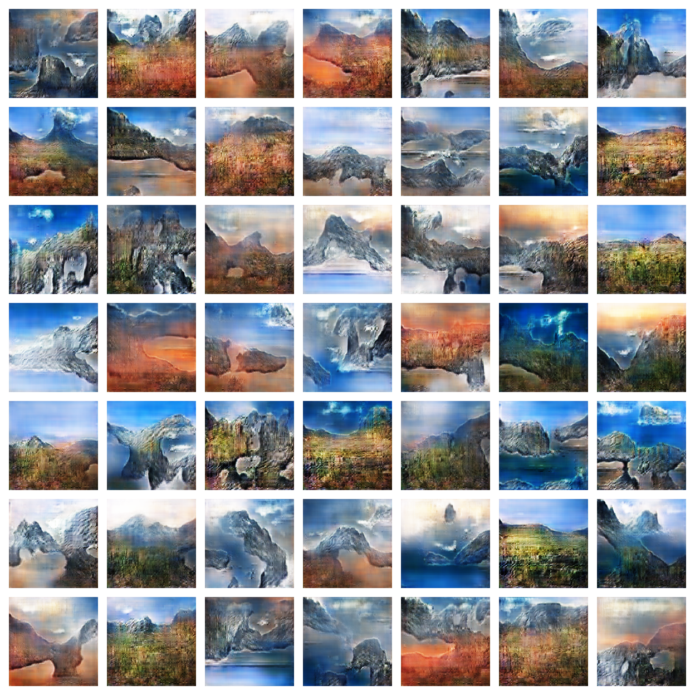

# Overview

This project seeks to explore GANs (Generative Adversarial Networks) where the model is trained to create randomized mountainous landscape imagery.

See the images below deemed to be some of the better-looking outputs across various training runs. All image outputs are of 160 X 160 px resolution.

## Training

Training occurs using 500 unique images of mountains found by scraping google images search queries using Python. Here is a list of search queries utilized in finding images:

- "Desert mountains"
- "Green mountains"
- "High mountains"
- "Rocky mountains"
- "Scottish Highlands mountains"
- "Snowy mountains"

From such queries, a heterogeneous dataset of mountainous images varying in color, geometry, and viewpoint was assembled.
The thumbnails of each image were manually checked to ensure that a mountainous landscape was being portrayed. After this quality check, only 479 images were deemed suitable. I decided to double the number of images by mirroring all 479 images and saving their copies. However, it is better to get additional 479 unique images instead of utilizing mirrored copies to double the dataset, thereby improving the quality of the training set. The training dataset can be found in the "resizedImages.zip" file.

## Mode Collapse

Mode Collapse occurs when the Generator begins outputting solutions that lack heterogeneity but may have the greatest probability of fooling the discriminator. Mode Collapse was apparent in all the runs with high number of epochs. When Mode Collapse did not go away for about 200-300 epochs, the training was terminated. In such scenarios, it was also found that solutions looked the best somewhere in the mid-range of total epochs executed. Though, too often, such solutions still fell short of desired quality of images.

The image below is the output of Epoch 1759 for a particular training run. It seems that there are two dominant types of output (greenish mountains and grey mountains with snow at base) with some common geometries and colors in each type.

The desired output would have been images of a variety of colors (ie. desert, rocky, green etc.), geometries, and viewpoints. Such desired output was apparent around ~Epoch 600. However, the images seemed much more noisy and the geometries of mountains in the images were even less convincing and a little more.. abstract-like? See output of Epoch 621 of the same run below:

## Findings

The following observations were arrived upon after running multiple training runs of varying training parameters:

1.  Higher batch sizes require more VRAM
2.  Smaller batches lead to greater number of epochs to be required as the solutions tend to fluctuate quite a bit from epoch to epoch
3.  Seed size has no effect on time per epoch
4.  High seed size reduces mode collapse
5.  Higher seed size requires more VRAM

6.  Having low number of batches (ie. say less than 17ish) makes Mode Collapse occur much sooner
7.  How low seed size makes Mode Collapse occur much sooner
8.  Pausing discriminator training to every other epoch can help the generator be more open to "exploring diverse solutions", thereby delaying Mode Collapse
9.  Training for higher res image output tends to Mode Collapse sooner

## Next Steps

While all training runs were GPU-computed,limitations to training included not being able to use larger batch sizes or to generate higher resolution images due to the limitation of VRAM on my laptop's graphics card (NVIDIA GTX 1060 - 6GB VRAM). Therefore, I plan to do further experimentation on achieving better quality of outputs using Google Colab (cloud-based Jupyter Notebooks Python environment) where much better hardware is available for computing.

Such ideas on further experimentation include further manipulation of learning rate, momentum values, bigger and more qualitative dataset and the labelling of data.
